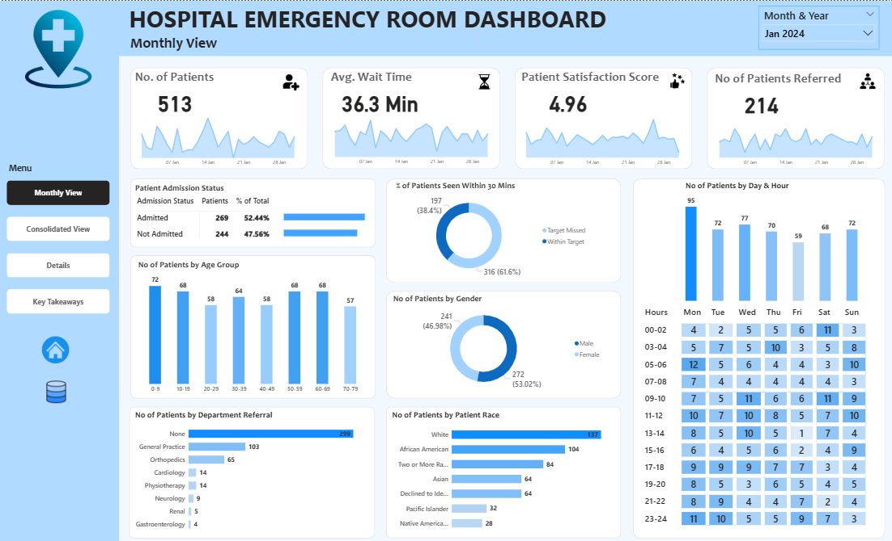

# Hospital Emergency Room Analysis

## Overview

This project provides a comprehensive analysis of a hospital's Emergency Room (ER) operations to enhance patient flow, optimize resource allocation, and improve patient satisfaction. A complete business intelligence solution was developed using Power BI, featuring a multi-page interactive dashboard that tracks key performance indicators and patient demographics in real-time.

## Business Problem

Efficiently managing an emergency room is critical for patient care and hospital operations. This project aims to address key operational questions to support data-driven improvements:
- Monitor daily and monthly patient volume to identify peak periods.
- Track and analyze average patient wait times to reduce delays.
- Evaluate patient satisfaction scores to improve service quality.
- Analyze patient demographics (age, gender, race) to understand the patient population.
- Assess admission rates and department referral patterns to optimize resource allocation.
- Determine the busiest days and hours to improve staff scheduling.

## Tools & Technologies

- **Business Intelligence:** Power BI
- **Languages:** DAX (Data Analysis Expressions), M Language (Power Query)
- **Version Control:** GitHub

## Project Structure

hospital-er-analysis/├── README.md├── dashboard/│   └── hospital_er_dashboard.pbix└── data/└── hospital_er_data.csv
## Data Cleaning & Preparation

- **Data Transformation (Power Query):**
  - Created a `patient full name` column by concatenating the first initial and last name.
  - Replaced abbreviations in the `Patient Gender` column with full text (e.g., 'M' to 'Male').
- **Calculated Columns & Measures (DAX):**
  - Engineered an `age group` column to segment patients into 10-year intervals.
  - Developed a `wait time status` column to classify patients as 'Within Target' or 'Target Missed' based on a 30-minute threshold.
  - Created an `admission status` column ('Admitted'/'Not Admitted') from a boolean flag.
- **Data Modeling:**
  - Built a dedicated **Date Table** using DAX to enable time intelligence analysis.
  - Established a one-to-many relationship between the Date Table and the main data table on the admission date.

## Key Metrics & KPIs

The dashboard monitors four headline KPIs to provide a high-level summary of ER performance:
- **Total No. of Patients:** Tracks the overall patient volume for the selected period.
- **Average Wait Time:** Measures the average time (in minutes) from arrival to being seen.
- **Patient Satisfaction Score:** An average score out of 10, reflecting the quality of patient experience.
- **No. of Patients Referred:** Counts the number of patients referred to other departments.

## Key Findings & Analysis

1.  **Peak Periods:** The busiest days are consistently **Mondays, Saturdays, and Tuesdays**. The peak hours are between **11 AM and 1 PM**, and late in the evening around **11 PM**, indicating a need for increased staffing during these times.

2.  **Wait Time Performance:** A significant majority (**65.6%**) of patients wait longer than the 30-minute target, with an average wait time of **35.3 minutes**. This highlights a key area for operational improvement to enhance patient flow.

3.  **Patient Demographics:** The largest age group visiting the ER is **Adults (30-39 years)**. The patient population is diverse, with the largest racial group being **White (2571 patients)**, followed by African American and multi-racial individuals.

4.  **Admission Patterns:** Nearly half of the patients (**46.1%**) are admitted to the hospital after their ER visit, while the rest are treated and released.

5.  **Department Referrals:** A large number of patients (**5400**) do not have a specific department referral. Among those who do, **General Practice (1840 cases)** and **Orthopedics (995 cases)** are the most common.

## Dashboard

The Power BI report is a multi-page solution designed for different analytical needs:
- **Monthly View:** Tracks performance for a selected month.
- **Consolidated View:** Provides an aggregated view over a custom date range.
- **Patient Details:** A detailed, tabular view for drilling down to individual patient records.
- **Key Takeaways:** A summary of the most critical insights and recommendations.

## How to Run This Project

1.  **Download the files:**
    - `dashboard/hospital_er_dashboard.pbix`
    - `data/hospital_er_data.csv`

2.  **Open the Dashboard in Power BI Desktop:**
    - Launch the `.pbix` file.
    - If the data connection is broken, go to `Transform data` -> `Data source settings`.
    - Select the `Hospital ER_Data.csv` source and click `Change Source...`.
    - Browse to the location where you saved the `.csv` file to re-establish the connection.

## Final Recommendations for Future Analysis

- **Reduce Wait Times:** Implement process improvements, such as a triage system or enhanced staff scheduling during peak hours, to reduce the average wait time and increase the percentage of patients seen within 30 minutes.
- **Optimize Staffing:** Adjust staffing levels based on the identified peak days (Monday, Saturday, Tuesday) and hours (11 AM - 1 PM, 11 PM) to better manage patient flow.
- **Enhance Patient Experience:** Investigate the root causes of the moderate patient satisfaction score (4.99/10) to identify specific areas for improvement in patient care and communication.

---

## Contact
**Ayush Butoliya** 

Email: ayushbutoliya22@gmail.com
